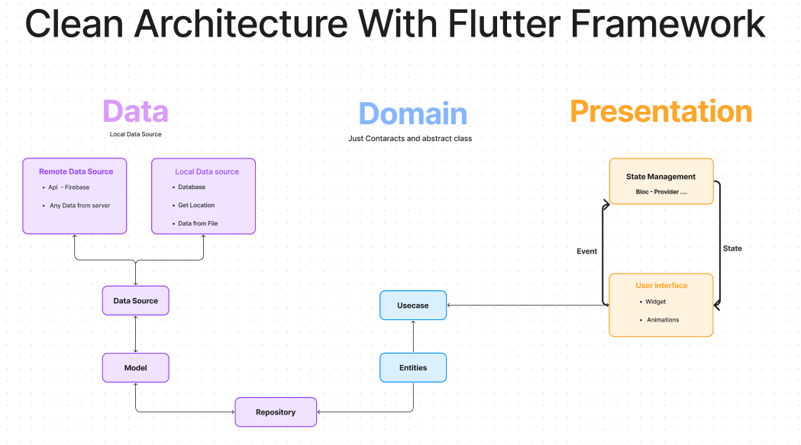
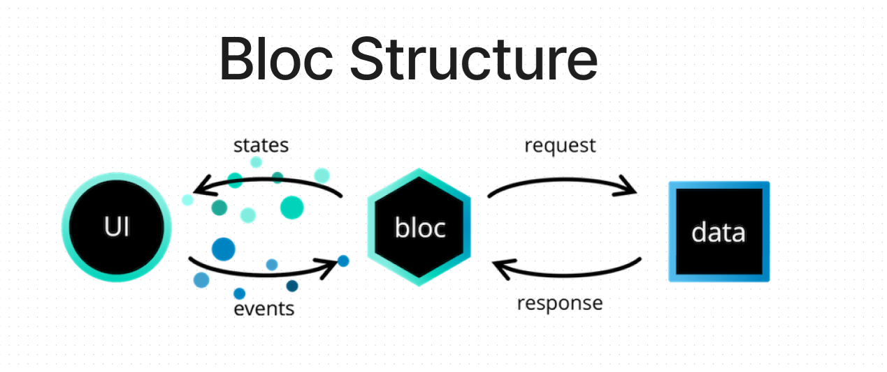

# clean_architecture_movies_app
## two modules  
      // movies
      // tvs
     for each module : 
             - presentation layer
                  screens 
                  components  or widgets
                  controller
             - domain layer 
                  entities
                  usecases   ( nowPlaying    ,, getpopular  ,, getTopRated )  
                  repository
             - data layer 
                 models
                 datasource 
                 repository

# Review Domain and Data layers 
    //domain movie entity --> movie -->  data model
    //UseCase   
    //Repository --> abstract methods
    // data  dataSource
    // data repository 

